# 🏦 Futurama Banking API

## 📌 Description

A Spring Boot REST API inspired by the Futurama universe for managing banks, customer accounts, and financial transactions.

The application allows users to create banks and accounts, perform deposits, withdrawals, transfers, and record financial transactions while following a clean layered Spring Boot architecture.

This project demonstrates backend software development using Java, Spring Boot, REST APIs, JPA/Hibernate, and database persistence.

---

## 🚀 Features

- Create, read, update and delete banks
- Create, read and delete accounts
- Deposit money into accounts
- Withdraw money from accounts
- Transfer money between accounts
- Create and retrieve transactions
- Entity validation using Jakarta Validation
- RESTful API design
- Layered architecture (Controller → Service → Repository)
- H2 Database integration
- Swagger / OpenAPI documentation

---

## 🛠️ Tech Stack

- Java 17
- Spring Boot
- Spring Web
- Spring Data JPA
- Hibernate
- H2 Database
- Lombok
- Maven
- Swagger / OpenAPI
- IntelliJ IDEA

---

## 🏗️ Architecture

The application follows a layered architecture:

```
Client
   │
REST API
   │
Controller
   │
Service
   │
Repository
   │
H2 Database
```

---

## 📂 Project Structure

```
Controller
│
├── Service
│
├── Repository
│
├── Entity
│
├── DTO
│
├── Mapper
│
├── Exception
│
└── Enums
```

---

## ▶️ Running the Project

Clone the repository

```bash
git clone https://github.com/Peter-c-dev/futurarma-wallet.git
```

Navigate into the project

```bash
cd futurarma-wallet
```

Run the application

```bash
mvn spring-boot:run
```

Open Swagger

```text
http://localhost:8080/swagger-ui/index.html
```

Open the H2 Database Console

```text
http://localhost:8080/h2-console
```

---

## 📸 Screenshots

### 🏗️ Project Structure


### 🏦 Create Bank

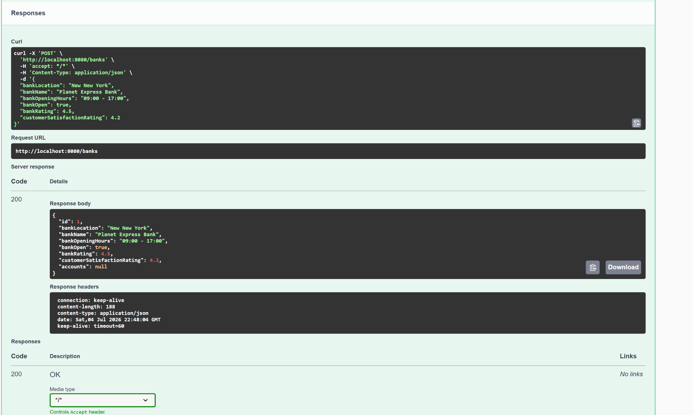

### 📋 Get All Banks

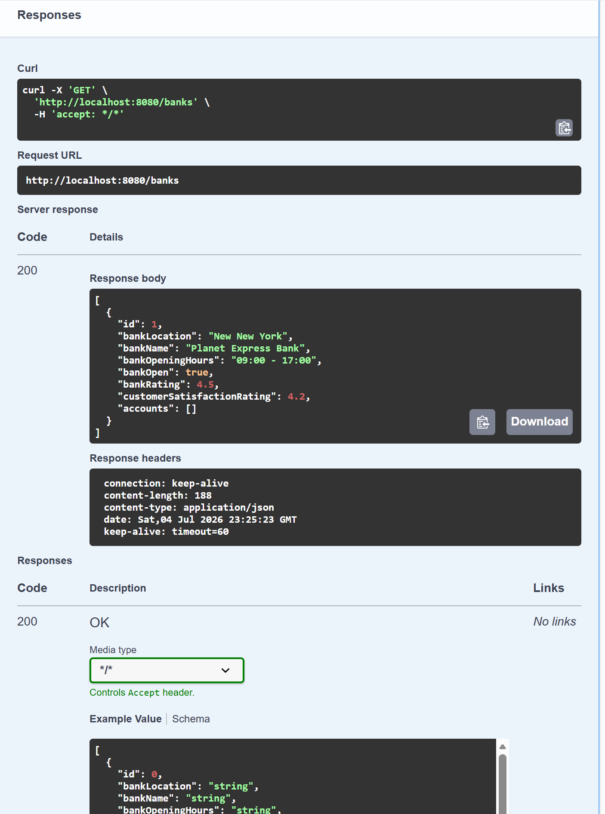

### 🔍 Get Bank By ID

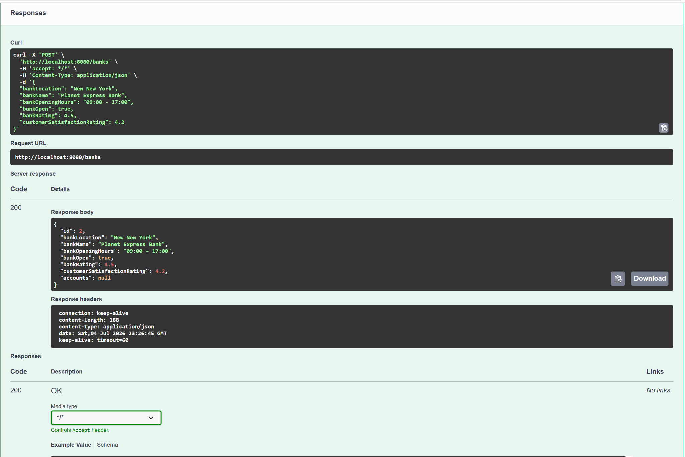

### ✏️ Update Bank

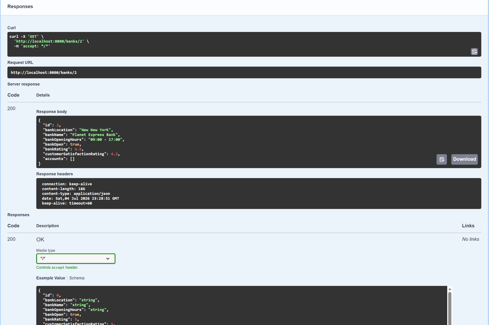

### 🗑️ Delete Bank

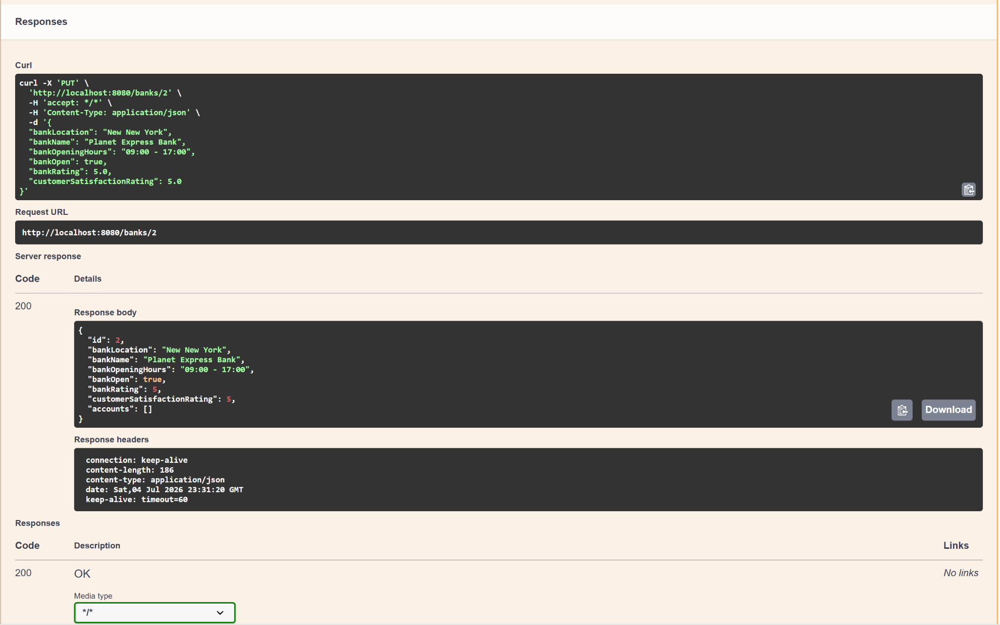

### 💳 Create Account

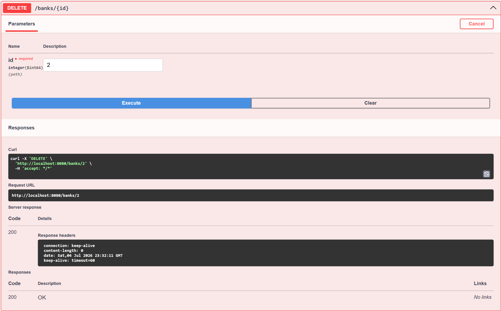

### 📋 Get All Accounts

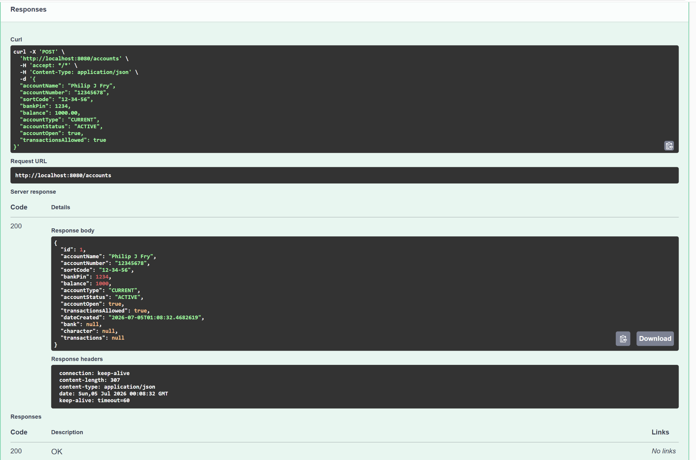

### 🔍 Get Account By ID

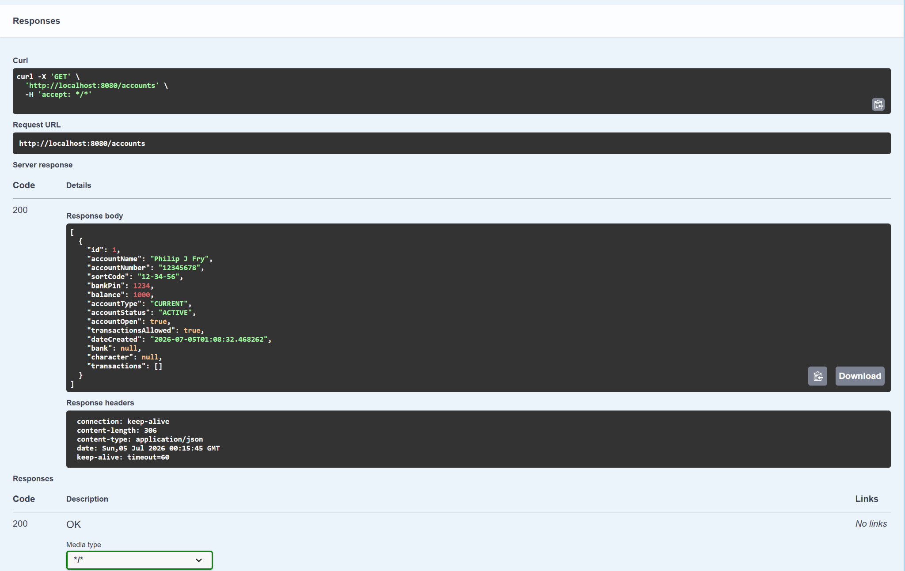

### 💰 Deposit Money

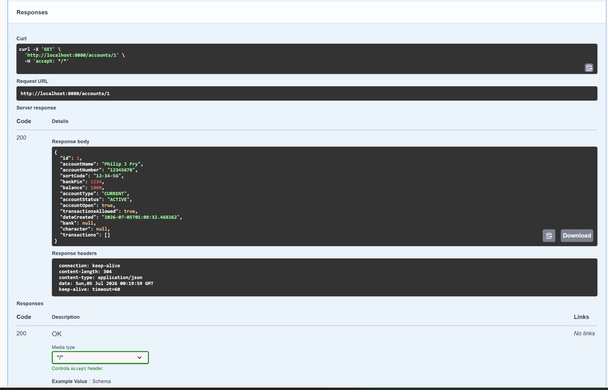

### 💸 Withdraw Money

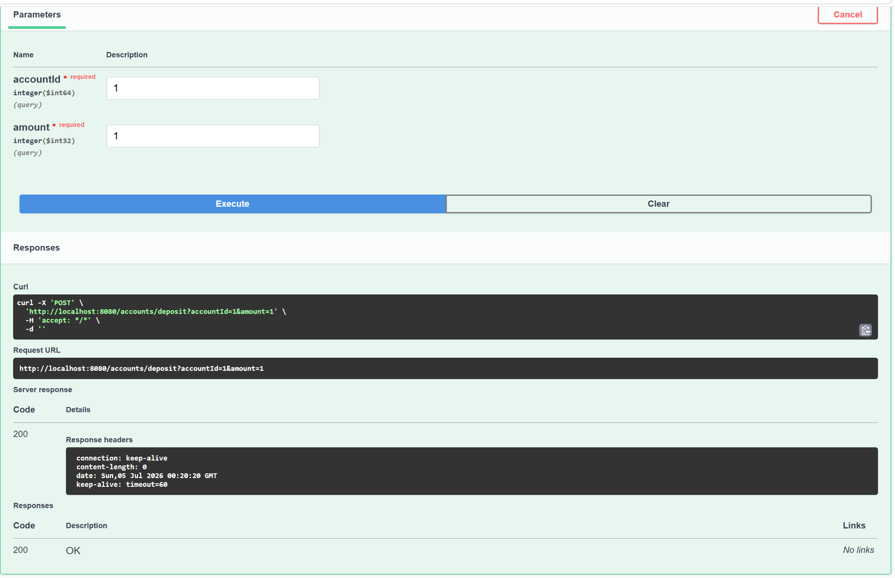

### 🔄 Transfer Money

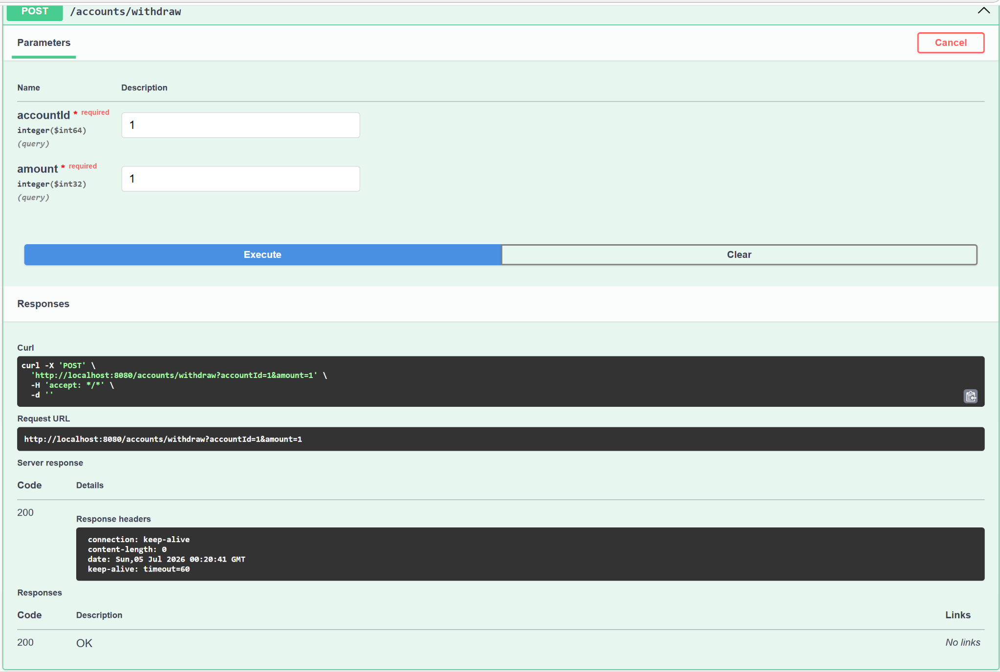

### 🧾 Create Transaction

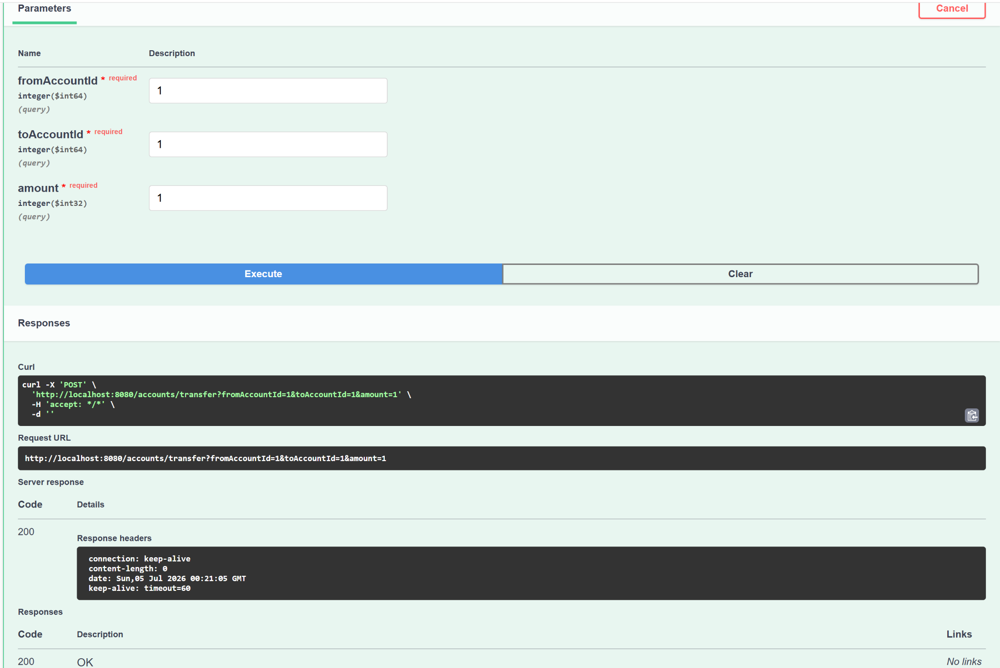

### 📋 Get All Transactions

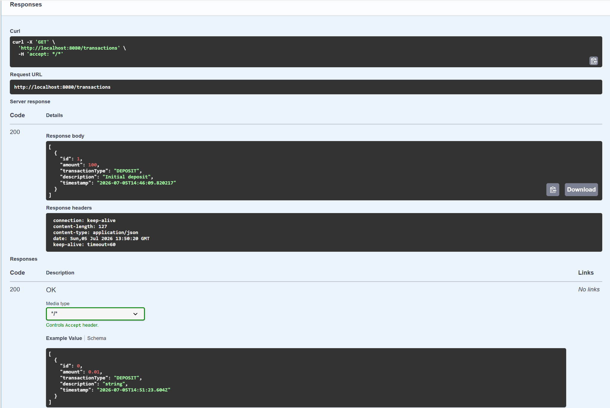

### 🔍 Get Transaction By ID

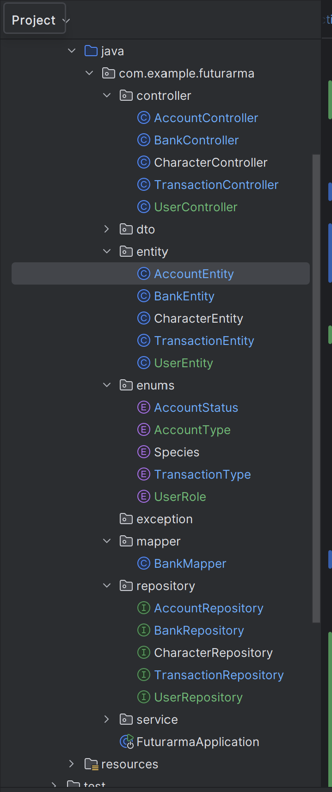

---

## 📡 API Endpoints

| Method | Endpoint | Description |
|---------|----------|-------------|
| POST | `/banks` | Create bank |
| GET | `/banks` | Get all banks |
| GET | `/banks/{id}` | Get bank by ID |
| PUT | `/banks/{id}` | Update bank |
| DELETE | `/banks/{id}` | Delete bank |
| POST | `/accounts` | Create account |
| GET | `/accounts` | Get all accounts |
| GET | `/accounts/{id}` | Get account by ID |
| POST | `/accounts/deposit` | Deposit money |
| POST | `/accounts/withdraw` | Withdraw money |
| POST | `/accounts/transfer` | Transfer money |
| POST | `/transactions` | Create transaction |
| GET | `/transactions` | Get all transactions |
| GET | `/transactions/{id}` | Get transaction by ID |

---

## 📊 Project Summary

- 5 Entities
- 5 Controllers
- 5 Services
- 5 Repositories
- 15+ REST API endpoints
- Swagger / OpenAPI documentation
- H2 Database
- Layered Spring Boot architecture

---

## 📚 What I Learned

During this project I strengthened my understanding of:

- Spring Boot application architecture
- RESTful API development
- CRUD operations
- Layered architecture
- JPA/Hibernate relationships
- Repository and Service patterns
- Transaction handling
- Validation using Jakarta Validation
- API testing using Swagger / OpenAPI

---

## 🚀 Future Improvements

- Add JWT authentication
- Encrypt user passwords using BCrypt
- Add pagination and sorting
- Improve exception handling
- Add unit tests with JUnit and Mockito
- Connect to MySQL or PostgreSQL

---

## 📄 License

This project was created for learning and portfolio purposes.

---

## 👨‍💻 Author

**Peter Cross**

GitHub: https://github.com/Peter-c-dev
